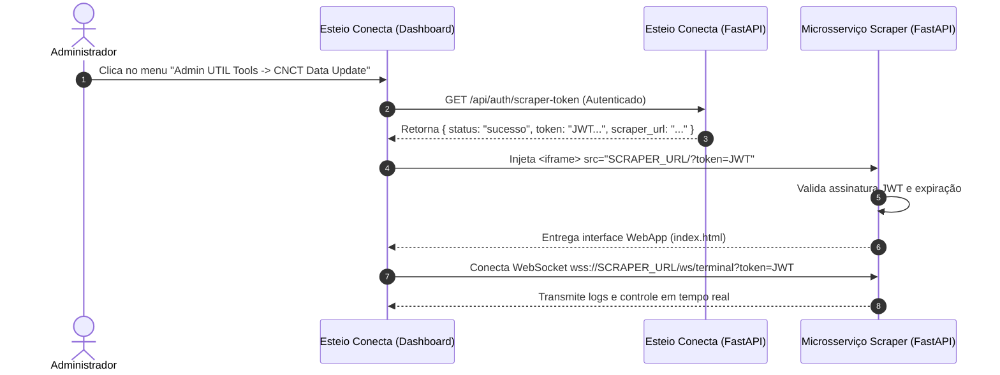

# Padrão de Arquitetura - Microsserviços Administradores via Iframe (Esteio Conecta)

Este documento estabelece a especificação técnica, os requisitos de segurança, a identidade visual e o padrão de integração para **microsserviços utilitários administrativos** integrados ao dashboard do **Esteio Conecta** através de `<iframe>`.

---

## 📌 1. Visão Geral da Arquitetura

O **Esteio Conecta** atua como a aplicação principal (Portal de Gestão). Ferramentas utilitárias para administradores (como o **CNCT Scraper**) são desenvolvidas como microsserviços autônomos (FastAPI/Python) e embutidas dinamicamente na interface principal através de `<iframe>`.



---

## 🔐 2. Autenticação e Segurança (JWT & Sessão)

### 2.1. Geração do Token (Backend Principal - Esteio Conecta)
* **Endpoint:** `GET /api/auth/scraper-token` (protegido pela sessão do usuário logado).
* **Algoritmo de Assinatura:** `HS256`.
* **Payload JWT:**
  ```python
  import time
  now_ts = int(time.time())
  payload = {
      "exp": now_ts + 7200,  # 2 horas de validade (7.200 segundos) para suporte a raspagens longas
      "iat": now_ts
  }
  token = jwt.encode(payload, settings.SCRAPER_JWT_SECRET, algorithm="HS256")
  ```
* **Chave Compartilhada:** Definida na variável de ambiente `SCRAPER_JWT_SECRET` em ambos os `.env`.

### 2.2. Validação no Microsserviço
* O microsserviço intercepta o parâmetro `?token=...` na requisição raiz (`/`) e nas chamadas REST/WebSocket.
* **Validação de Token:**
  ```python
  def decode_jwt_token(token: str) -> Optional[Dict[str, Any]]:
      if not token:
          return None
      try:
          secret = os.getenv("SCRAPER_JWT_SECRET", SCRAPER_JWT_SECRET)
          return jwt.decode(token, secret, algorithms=["HS256"])
      except Exception as e:
          print(f"[AUTH ERRO] Falha ao decodificar JWT: {e}")
          return None
  ```
* **Cookie HttpOnly de Sessão:** Ao validar o token inicial, o microsserviço grava o cookie `scraper_session` com `max_age=86400` (24 horas) para suportar a navegação interna.

---

## 🌐 3. Segurança HTTP & Cabeçalhos Iframe (CSP e CORS)

Para permitir a incorporação segura sem vulnerabilidades de *Clickjacking* ou bloqueios de navegadores:

### 3.1. Headers de Segurança no Microsserviço
* **Remoção do `X-Frame-Options`:** Deve ser removido do middleware para não bloquear a renderização em `<iframe>`.
* **Content-Security-Policy (CSP):** Configurar `frame-ancestors` apontando para a origem autorizada:
  ```python
  @app.middleware("http")
  async def iframe_security_headers_middleware(request: Request, call_next):
      response = await call_next(request)
      if "X-Frame-Options" in response.headers:
          del response.headers["X-Frame-Options"]

      origins_str = " ".join(ALLOWED_ORIGINS) if ALLOWED_ORIGINS else "*"
      response.headers["Content-Security-Policy"] = f"frame-ancestors 'self' {origins_str};"
      return response
  ```

### 3.2. Atributos do Iframe no Frontend (Dashboard)
O `<iframe>` injetado pelo JavaScript no frontend do Esteio Conecta DEVE obrigatoriamente possuir as seguintes permissões no atributo `sandbox`:
```html
<iframe 
    src="${srcUrl}" 
    style="width: 100%; height: calc(100vh - 180px); border: none;" 
    allowfullscreen
    sandbox="allow-scripts allow-same-origin allow-forms allow-downloads">
</iframe>
```
> ⚠️ **IMPORTANTE:** Sem a diretiva `allow-downloads`, o navegador bloqueia silenciosamente qualquer download de arquivo (ex: CSVs) acionado dentro do iframe.

---

## 🔌 4. WebSockets em Ambiente Cross-Origin / Iframe

### 4.1. Repasse de Token na Conexão
Para evitar bloqueios de cookies de terceiros (*Third-Party Cookies*) entre portas ou subdomínios diferentes:
1. O client JS do microsserviço captura o token da URL (`window.location.search`).
2. Anexa o token como Query Parameter na URL do WebSocket:
   ```javascript
   const urlParams = new URLSearchParams(window.location.search);
   const token = urlParams.get('token');
   const tokenParam = token ? `?token=${encodeURIComponent(token)}` : '';
   const wsUrl = `${protocol}//${window.location.host}/ws/terminal${tokenParam}`;
   ```

### 4.2. Ordem Correta do Handshake FastAPI
No endpoint de WebSocket do FastAPI, o handshake deve ser aceito (`await websocket.accept()`) **antes** de validar ou encerrar a conexão, evitando retornos genéricos `403 Forbidden` do Uvicorn:
```python
@app.websocket("/ws/terminal")
async def websocket_terminal_endpoint(websocket: WebSocket):
    await websocket.accept()  # 1. Aceita o handshake primeiro

    token = websocket.query_params.get("token") or websocket.cookies.get(COOKIE_NAME)
    if not token or decode_jwt_token(token) is None:
        await websocket.send_text("[ERRO] Sessão expirada ou token JWT inválido.")
        await websocket.close(code=1008)
        return

    await ws_manager.connect(websocket)  # 2. Registra a conexão ativa (sem chamar accept novamente)
```

---

## 💾 5. Preservação de Dados e Versionamento (Timestamping)

Para evitar que execuções de teste ou parciais sobrescrevam dados históricos completos:

1. **Nomeação por Timestamp:** Os arquivos gerados são gravados com o carimbo de data e hora (`YYYYMMDD_HHMMSS`):
   - `output/csv_cursos_20260804_000912.csv`
   - `output/csv_instituicoes_20260804_000912.csv`
2. **Ponteiro de Atalho (`latest`):** Uma cópia atualizada é mantida em `csv_cursos.csv` e `csv_instituicoes.csv` para download rápido.
3. **Links de Download Autenticados:** Os links de download no frontend do microsserviço anexam automaticamente o token da URL:
   ```javascript
   link.setAttribute('href', `${baseHref}?token=${encodeURIComponent(token)}`);
   ```

---

## 🎨 6. Padrão de Identidade Visual e Interface (UI/UX)

* **Menu de Acesso (Navbar do Esteio Conecta):**
  - Dropdown alinhado à direita: **"Admin UTIL Tools"**.
  - Sub-itens com ícones descritivos (Bootstrap Icons): `<i class="bi bi-database-gear me-2 text-primary"></i> CNCT Data Update`.
* **Cabeçalho da Ferramenta no Iframe:**
  - Card responsivo com botão de controle: **"Renovar Sessão / Recarregar"** para facilitar novos fetches de token sem precisar dar reload no portal.
  - Tema escuro / moderno para consoles de execução e terminal de logs em tempo real.

---

## 🌍 7. Configuração de Ambientes (Dev Local vs Coolify / VPS)

O sistema utiliza a variável `SCRAPER_APP_URL` configurada no `.env` (ou no painel do Coolify) sem alterar uma linha de código:

| Ambiente | `SCRAPER_APP_URL` | `ALLOWED_ORIGINS` |
| :--- | :--- | :--- |
| **Desenvolvimento Local** | `http://localhost:8000` | `http://localhost:8080,http://127.0.0.1:8080,http://localhost:8000` |
| **Staging / VPS (Coolify)** | `https://scraper-staging.seu-dominio.com` | `https://esteioconecta.seu-dominio.com` |

> 📌 **Carregamento de `.env` com Pydantic Settings:**
> Para garantir que o `.env` seja localizado independentemente do diretório de trabalho (*CWD*) em IDEs como PyCharm, utilize caminho absoluto:
> ```python
> ROOT_DIR = Path(__file__).resolve().parent.parent
> ENV_FILE = ROOT_DIR / ".env"
> ```

---

## 📋 8. Checklist para Criação de Novas Ferramentas de Microsserviço

Ao implementar uma nova ferramenta para administradores:

- [ ] **1.** Definir nome e chave do microsserviço (ex: `UTIL_TOOL_SECRET`).
- [ ] **2.** Criar rota de emissão de token no Esteio Conecta (`/api/auth/nova-ferramenta-token`).
- [ ] **3.** Adicionar o sub-item no dropdown **"Admin UTIL Tools"** no `index.html` do Esteio Conecta.
- [ ] **4.** Configurar o middleware de CORS e CSP `frame-ancestors` no novo microsserviço.
- [ ] **5.** Aplicar validação JWT no `read_root` e nos endpoints da API do microsserviço.
- [ ] **6.** Garantir que a tag `<iframe>` tenha o atributo `sandbox` com `allow-downloads`.
- [ ] **7.** Garantir que arquivos de saída usem carimbo de data e hora para preservação de histórico.
